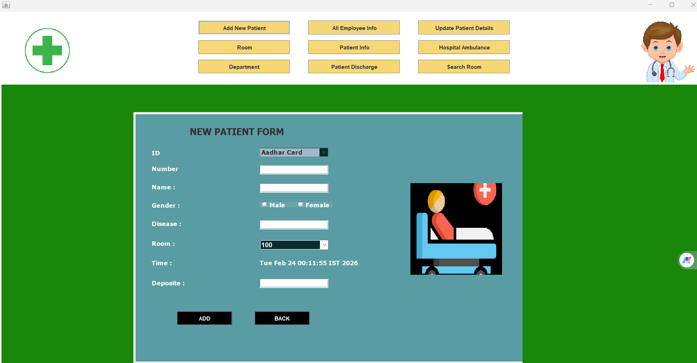

# 🏥 E-Health Care Management System

A desktop-based Hospital Management System developed using **Java Swing**, **MySQL**, and **JDBC**.  
This system streamlines hospital operations including patient management, doctor scheduling, appointment booking, prescription handling, room allocation, and ambulance services.

---

## 🚀 Features

### 👤 Patient Module
- Patient Registration & Secure Login
- View Medical History
- Book Appointments
- View Prescriptions

### 👨‍⚕️ Doctor Module
- Doctor Login Dashboard
- View & Manage Appointments
- Add & Update Prescriptions
- Update Patient Status

### 🏥 Admin Module
- Manage Doctors & Patients
- Room & Bed (Cot) Management
- Ambulance Management
- Contact & Patient Details Management
- Appointment Monitoring

---

## 🛠️ Tech Stack

- **Java (Swing)** – GUI Development
- **MySQL** – Relational Database
- **JDBC** – Database Connectivity
- **OOP Concepts** – Modular Architecture

---

## 🗂️ Project Architecture

The project follows a layered architecture:

- `model` – Entity Classes (Patient, Doctor, Appointment, etc.)
- `dao` – Database Access Layer (JDBC Operations)
- `ui` – Swing UI Frames & Panels
- `Main.java` – Application Entry Point

---

## 🗄️ Database Design

Key Tables:
- patients
- doctors
- appointments
- prescriptions
- rooms
- ambulance

Relational structure implemented using Primary & Foreign Keys.

---

## 🔐 Security & Validation

- Input Validation
- Exception Handling
- Structured Error Management
- Proper Database Connection Handling

---

## 📸 Screenshots

---

## 📌 Key Highlights

- Real-world hospital workflow simulation
- Strong implementation of OOP principles
- Practical use of JDBC connectivity
- Modular and scalable structure
- Desktop-based enterprise-style system

---

## 📦 Future Improvements

- Password Encryption
- Role-based Access Control
- Billing & Payment Integration
- Report Generation (PDF)
- Cloud-based Deployment

---

## 👨‍💻 Developed By

**Millan Kumar Behera**  
B.Tech CSE | Cybersecurity Enthusiast | Java Developer  

---
